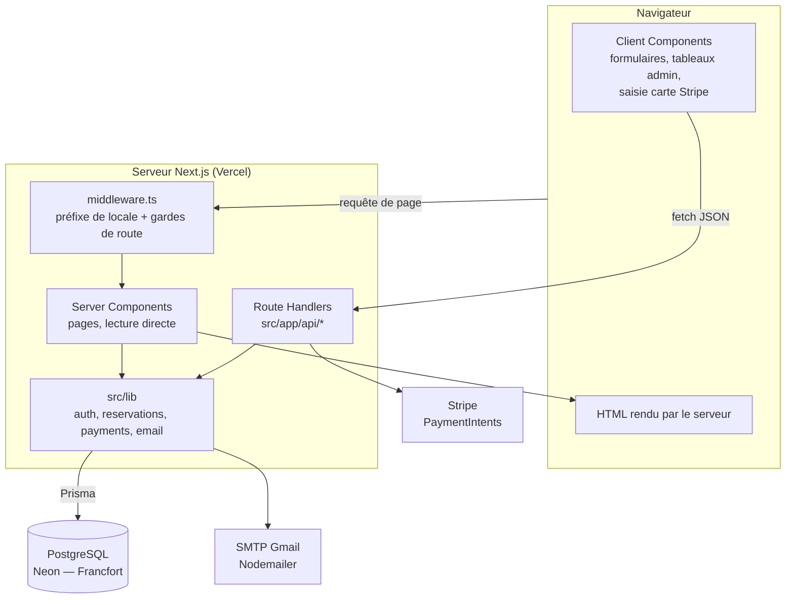
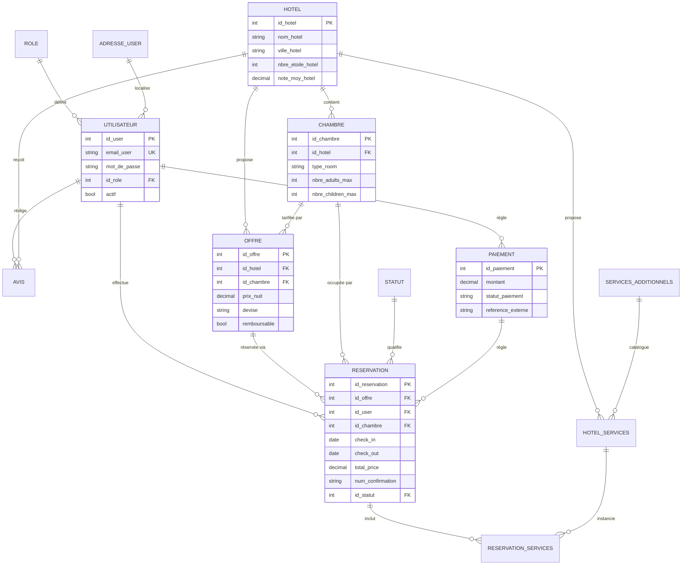
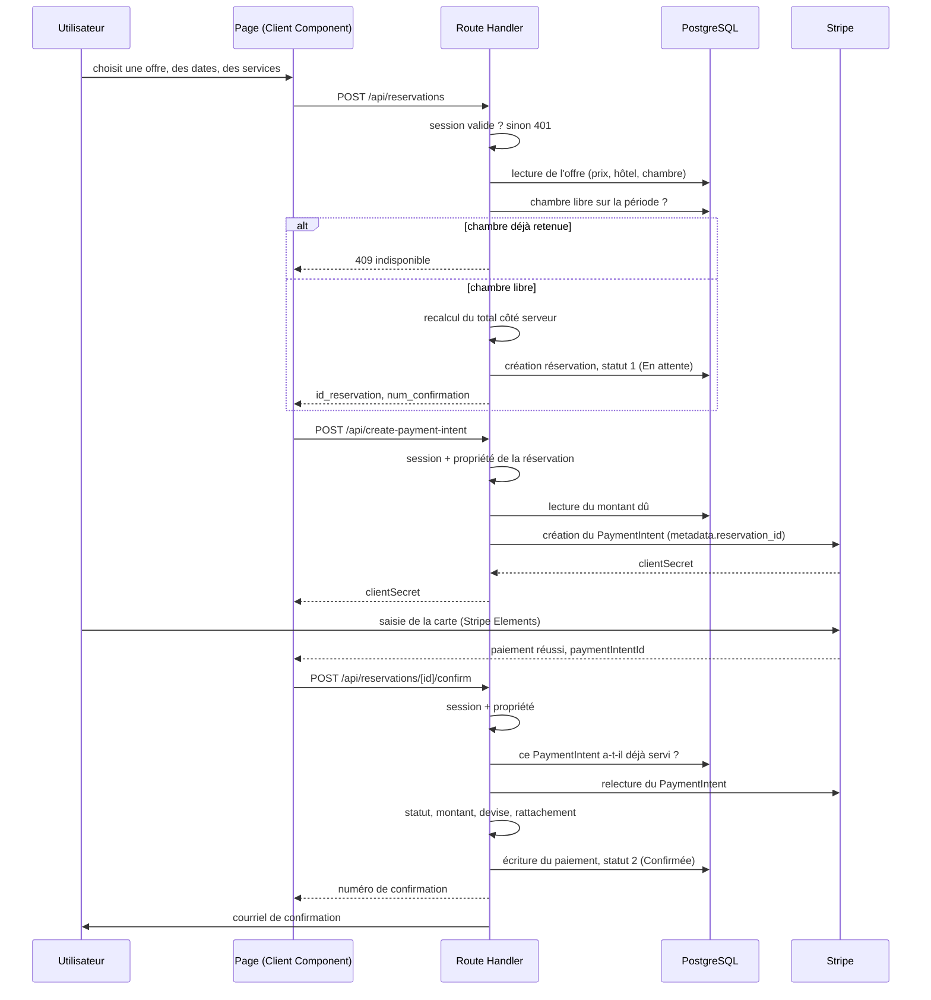

# Documentation technique

**Book Your Travel — application de réservation hôtelière**
Projet Bloc 3 (Framework) — certification Développeur Web
Yannick Franchaisse — septembre 2026

Dépôt : https://github.com/yanni-bit/hotel-booking-bloc3
Démonstration : https://hotel-booking-bloc3.vercel.app

---

## Sommaire

1. Présentation du projet
2. Choix technologiques
3. Architecture générale
4. Modèle de données
5. Organisation du code
6. Authentification et autorisation
7. Le parcours de réservation
8. Sécurité
9. Tests et débogage
10. Performance et accessibilité
11. Déploiement
12. Limites assumées et pistes d'évolution

---

## 1. Présentation du projet

### 1.1 Ce que fait l'application

Book Your Travel est une plateforme de réservation d'hôtels en ligne. Un visiteur cherche une destination, parcourt les établissements disponibles, consulte une fiche détaillée, choisit une chambre et une formule tarifaire, ajoute éventuellement des services (parking, petit-déjeuner, spa), paie par carte et reçoit un numéro de confirmation par courriel. Un administrateur dispose d'un back-office pour gérer les hôtels, suivre les réservations et administrer les comptes.

La base contient 102 hôtels répartis sur 12 destinations, 408 chambres, 1 320 offres tarifaires et 472 avis. Ce volume n'est pas décoratif : il permet de vérifier que la pagination, la recherche et les temps de réponse tiennent sur un jeu de données réaliste plutôt que sur trois enregistrements de démonstration.

### 1.2 Filiation avec le Bloc 2

Ce projet n'est pas une application nouvelle. Il reprend le périmètre fonctionnel de mon projet Bloc 2, développé en Angular 20 avec une API Node.js et une base MySQL, et le réimplémente entièrement avec un framework React full-stack.

Ce choix était délibéré. Repartir d'un cahier des charges déjà maîtrisé m'a permis de concentrer l'effort sur ce que le Bloc 3 évalue réellement : la maîtrise d'un framework, pas l'invention d'un besoin métier. Je savais exactement quoi construire ; la question était comment le construire autrement.

Le passage d'Angular à React n'est pas une traduction ligne à ligne. Les deux frameworks répondent différemment aux mêmes problèmes, et une partie de ce document consiste précisément à expliquer où j'ai dû changer de raisonnement plutôt que de syntaxe.

### 1.3 Périmètre

Ce qui est couvert :

- recherche d'hôtels par destination, avec pagination
- fiche hôtel à cinq onglets (description, chambres et offres, équipements, avis, localisation)
- tunnel de réservation complet avec services additionnels et calcul du total
- paiement par carte via Stripe, en mode test
- comptes utilisateurs : inscription, connexion, profil, mot de passe oublié, historique des réservations, annulation
- courriels transactionnels : bienvenue, confirmation de réservation, annulation, réinitialisation de mot de passe
- back-office administrateur : création et édition des hôtels, suivi des réservations et changement de statut, gestion des comptes et des rôles
- interface adaptative mobile et bureau

Ce qui ne l'est pas, et pourquoi, fait l'objet de la section 12.

### 1.4 Chiffres du projet

- 129 fichiers TypeScript et TSX dans `src/`
- 20 modèles de données, 5 migrations versionnées
- 29 pages et 29 routes d'API
- 58 tests unitaires répartis en 9 suites
- 103 ko de JavaScript partagé par toutes les pages

---

## 2. Choix technologiques

### 2.1 Une décision que j'ai prise puis annulée

Je commence par celle-là parce qu'elle est la plus instructive.

Mon intention initiale était de bâtir l'application sur Medusa.js, une plateforme de commerce sans interface imposée, avec Next.js en vitrine. Le raisonnement tenait : Medusa apportait une administration prête à l'emploi et une architecture découplée, deux arguments qui comptaient à mes yeux dans le secteur où je cherchais un stage.

J'ai travaillé plusieurs jours dessus avant de faire machine arrière le 15 septembre. Trois raisons :

La première est que Medusa est conçu pour vendre des produits, pas des nuitées. Une réservation possède une date d'arrivée, une date de départ et une notion d'occupation qui n'existent pas dans un panier de commerce classique. Je passais mon temps à contourner le modèle de données plutôt qu'à m'appuyer dessus.

La deuxième tient au cahier des charges. Il demande « la récupération et l'affichage des services via l'API », sans jamais prescrire de serveur distinct. Les Route Handlers de Next.js sont une API : l'exigence est satisfaite sans second processus. Ajouter Medusa revenait donc à faire tourner deux serveurs, deux gestionnaires de paquets et deux systèmes d'authentification pour un bénéfice que je n'arrivais plus à formuler.

La troisième est que l'administration fournie par Medusa m'aurait dispensé d'écrire le back-office moi-même — c'est-à-dire de démontrer exactement la compétence que le bloc évalue.

J'ai donc supprimé les dossiers `backend/` et `backend-storefront/` et reconstruit un projet Next.js seul. Je documente cet abandon parce qu'un choix technique qu'on révise après l'avoir éprouvé vaut mieux qu'un choix qu'on n'a jamais interrogé.

### 2.2 Next.js 15 plutôt qu'un front seul

Next.js seul fournit exactement ce que l'attelage Medusa et Next.js m'apportait : un serveur, des routes d'API, une interface, une administration. La différence n'est pas dans la capacité, elle est dans le nombre de couches. Medusa n'ajoutait aucune fonction dont ce projet avait besoin et que le framework ne savait pas assurer ; il ajoutait un second processus à lancer, à configurer, à maintenir et à tenir compatible.

En le retirant, tout se déplace dans une seule arborescence : les pages sont rendues côté serveur, les routes d'API vivent à côté d'elles, et le typage TypeScript traverse la frontière sans sérialisation intermédiaire. Une modification du modèle de données se propage du schéma Prisma jusqu'au composant sans passer par un contrat d'API à maintenir en double.

Le bénéfice le plus concret est le Server Component. Une page qui affiche la liste des hôtels interroge Prisma directement, dans la fonction du composant, et renvoie du HTML déjà peuplé. Pas de `useEffect`, pas d'état de chargement, pas de requête réseau depuis le navigateur. En Angular, la même page suppose un service injecté, un observable, un `async` dans le gabarit et un état intermédiaire à gérer.

Le coût est qu'il faut savoir en permanence quel code s'exécute où. Un composant qui utilise `useState` ou un gestionnaire d'événement doit être marqué `"use client"` ; il est alors envoyé au navigateur. Cette frontière n'existe pas en Angular, où tout est client. C'est la principale chose que j'ai eu à réapprendre.

### 2.3 Prisma plutôt que du SQL écrit à la main

En Bloc 2, j'écrivais mes requêtes SQL directement. Prisma apporte trois choses que je n'avais pas.

Le typage d'abord : le client Prisma est généré à partir du schéma, donc une faute de frappe sur un nom de colonne est signalée à la compilation et non en production. Les migrations ensuite : chaque modification du schéma produit un fichier SQL versionné dans Git, et `prisma migrate deploy` rejoue la même séquence sur n'importe quel environnement. Les relations enfin : `include` remplace des jointures écrites à la main, avec un résultat typé.

Le prix à payer est réel. Prisma renvoie les colonnes `Decimal` comme des objets `Decimal` et non comme des nombres JavaScript, ce qui oblige à convertir explicitement partout où un prix est affiché ou calculé. C'est verbeux, mais c'est volontaire de la part de la bibliothèque : elle refuse de perdre silencieusement de la précision sur des montants.

### 2.4 jose plutôt que jsonwebtoken

Ce choix n'en est pas un, c'est une contrainte, et elle mérite d'être comprise plutôt que subie.

Le middleware de Next.js ne s'exécute pas dans Node.js mais dans l'Edge Runtime, un environnement allégé qui ne dispose pas des modules natifs de Node — dont le module `crypto` sur lequel `jsonwebtoken` repose. Une tentative d'import échoue à la compilation.

La bibliothèque `jose` s'appuie sur l'API Web Crypto, disponible dans les deux environnements. Elle est donc utilisable indifféremment dans le middleware et dans les routes d'API, ce qui évite d'avoir deux implémentations de vérification de jeton dans le même projet.

### 2.5 Le reste de la pile

- **React 19 et TypeScript 5** : le typage strict prolonge mon expérience Angular, où il était imposé par le framework.
- **Tailwind CSS 3.4** : les styles vivent dans le balisage, ce qui supprime la question du nommage des classes et la dérive des feuilles globales. Les motifs répétés sont regroupés dans `globals.css` via `@apply`.
- **Stripe** : PaymentIntents en mode test, avec une interface de saisie construite à partir des composants Stripe Elements.
- **Nodemailer** : envoi via SMTP Gmail avec un mot de passe d'application.
- **PostgreSQL** : la base du Bloc 2 était en MySQL ; la conversion a été faite lors de la reprise du jeu de données.

---

## 3. Architecture générale

### 3.1 Vue d'ensemble



### 3.2 Ce qui s'exécute où

La distinction structure tout le projet.

**Côté serveur** s'exécutent le middleware, les Server Components, les Route Handlers et tout le contenu de `src/lib`. C'est là que vivent la chaîne de connexion à la base, la clé secrète des jetons et la clé secrète Stripe. Rien de tout cela n'atteint le navigateur.

**Côté client** s'exécutent uniquement les composants marqués `"use client"` : les formulaires, les tableaux de l'administration avec leur recherche et leur pagination, le champ de saisie de carte bancaire. Ils ne parlent jamais à la base ; ils appellent les routes d'API en `fetch`.

Une conséquence importante : un contrôle écrit dans un Client Component n'est pas une sécurité, c'est un confort d'utilisation. Toute règle qui compte est revérifiée côté serveur. La section 8 détaille ce que cela implique.

### 3.3 Le middleware, et ce qu'il ne fait pas

Le fichier `src/middleware.ts` s'exécute avant le rendu de chaque page. Il remplit deux rôles.

Il normalise l'URL : toute adresse sans code pays est redirigée vers son équivalent préfixé `/fr/`. Le segment `[countryCode]` existe dans l'arborescence pour préparer une internationalisation ; seul le français est actif aujourd'hui.

Il applique ensuite trois listes de gardes : les routes qui exigent une session (`/profil`, `/mes-reservations`, `/payment`, `/reservations`), celles qui exigent le rôle administrateur (`/admin`), et celles qui sont réservées aux visiteurs non connectés (`/login`, `/register`, et les deux pages de mot de passe). Une tentative d'accès non autorisée redirige vers la page de connexion en conservant l'URL demandée dans un paramètre `redirect`, de sorte que l'utilisateur atterrit là où il voulait aller une fois identifié.

Le point à retenir est dans la dernière ligne du fichier :

```ts
export const config = {
  matcher: [
    "/((?!api|_next/static|_next/image|favicon.ico|images|assets|png|svg|jpg|jpeg|gif|webp).*)",
  ],
};
```

Le motif **exclut `/api`**. Les routes d'API ne passent jamais par le middleware. Chacune vérifie la session elle-même, via `getCurrentUser()` ou `requireAdmin()`. Ce middleware filtre des adresses ; il ne protège pas des données.

C'est une différence de fond avec l'architecture du Bloc 2, où un middleware Express interceptait aussi bien les pages que les appels d'API. Ici, si j'écris une route d'API en oubliant d'y vérifier la session, rien ne me rattrape.

---

## 4. Modèle de données

### 4.1 Vue relationnelle

Le schéma complet compte 20 modèles. Le diagramme ci-dessous ne retient que le cœur du domaine ; les tables d'images, de favoris, d'équipements, de messages de contact et de réinitialisation de mot de passe sont omises pour rester lisible.



### 4.2 La distinction chambre / offre

C'est la subtilité du modèle et la question la plus probable à l'oral.

Une **chambre** est un bien physique : une catégorie, une capacité, une surface, une vue. Une **offre** est une proposition commerciale sur cette chambre : un prix par nuit, une devise, des conditions d'annulation, une formule de pension. Une même chambre porte donc plusieurs offres — typiquement une tarification souple plus chère et une tarification non remboursable moins chère.

Une réservation référence à la fois l'offre choisie et la chambre concernée. La redondance est voulue : la chambre est ce qui détermine la disponibilité, l'offre est ce qui détermine le prix, et les deux doivent rester interrogeables sans passer par une jointure supplémentaire.

La réservation recopie aussi `prix_nuit` et `total_price` au moment de la transaction. Si l'hôtelier change son tarif la semaine suivante, les réservations déjà passées gardent le prix convenu. Une facture ne se recalcule pas.

### 4.3 Tables de référence

Deux tables portent des valeurs fixes, alimentées à l'initialisation.

**Rôles** : 1 administrateur, 2 prestataire, 3 client. Toute inscription crée un compte client ; la constante `ROLES` dans `src/lib/auth.ts` évite que ces identifiants se retrouvent écrits en clair dans le code.

**Statuts de réservation** : 1 En attente, 2 Confirmée, 3 Annulée, 4 Refusée, 5 Terminée, 6 En cours. Ces six valeurs pilotent à la fois l'affichage (chaque statut porte une couleur) et la logique de disponibilité décrite en 7.4.

### 4.4 Conventions de nommage

Les noms de colonnes suivent la convention du Bloc 2 : `id_user`, `email_user`, `nom_hotel`, `prix_nuit`. Ce n'est pas la convention la plus répandue, et un développeur habitué à d'autres projets tiquera sur le suffixe.

Je l'ai conservée volontairement. Le jeu de données du Bloc 2 compte plus de 2 000 enregistrements ; renommer les colonnes aurait signifié réécrire le script d'import et introduire un risque d'erreur sur des données que je voulais précisément réutiliser à l'identique. La cohérence interne du projet m'a paru plus utile qu'une conformité à une convention externe.

### 4.5 Migrations

Cinq migrations versionnées dans `prisma/migrations/` :

| Migration | Objet |
|---|---|
| `20260113162106_init` | Schéma initial, 19 tables |
| `20260114000000_add_destination` | Table `destination` pour la page d'accueil |
| `20260114000001_add_avis_count_trigger` | Déclencheur de mise à jour du compteur d'avis |
| `20260114161214_add_avis_count_trigger` | Correction du déclencheur précédent |
| `20260119111552_add_telephone_to_messages_contact` | Ajout du téléphone au formulaire de contact |

La quatrième migration corrige la troisième. Je ne l'ai pas supprimée : une migration déjà appliquée sur un environnement ne se réécrit pas, elle se corrige par une migration suivante. C'est précisément l'intérêt du mécanisme, et l'historique doit rester le reflet fidèle de ce qui s'est passé.

---

## 5. Organisation du code

### 5.1 Arborescence

```
hotel-booking-bloc3/
├── README.md
├── docs/
│   ├── documentation-technique.md
│   ├── guide-utilisateur.md
│   ├── diagrammes/                MCD, architecture, séquence (PNG)
│   └── lighthouse/                rapports avant et après optimisation
└── frontend/
    ├── prisma/
    │   ├── schema.prisma          modèle de données, 20 modèles
    │   ├── migrations/            5 migrations SQL versionnées
    │   ├── import_data.sql        jeu de données repris du Bloc 2
    │   └── seed.ts                destinations et images, idempotent
    ├── public/images/             photographies, logo
    └── src/
        ├── middleware.ts          locale et gardes de route
        ├── app/
        │   ├── layout.tsx         racine HTML, métadonnées globales
        │   ├── globals.css        variables de charte et classes composées
        │   ├── [countryCode]/
        │   │   ├── (main)/        site public
        │   │   └── (admin)/admin/ back-office
        │   └── api/               29 Route Handlers
        ├── lib/                   accès aux données et services
        └── modules/               composants React par domaine
```

### 5.2 Groupes de routes

Les parenthèses dans `(main)` et `(admin)` définissent des groupes de routes. Elles n'apparaissent pas dans l'URL : `src/app/[countryCode]/(admin)/admin/hotels/page.tsx` se sert à l'adresse `/fr/admin/hotels`.

Leur utilité est de permettre deux mises en page distinctes au même niveau d'arborescence. Le groupe `(main)` applique l'en-tête et le pied de page du site public ; le groupe `(admin)` applique une barre latérale et aucun pied de page. Sans ce mécanisme, il faudrait soit un test conditionnel dans une mise en page unique, soit une duplication d'arborescence.

### 5.3 app/ et modules/

`src/app/` contient exclusivement le routage : un fichier `page.tsx` par URL, réduit à son minimum. Il lit ses paramètres, appelle une fonction de `src/lib`, et passe les données à un composant de `src/modules`.

`src/modules/` contient les composants React, groupés par domaine fonctionnel : `home`, `hotels-list`, `hotel-detail`, `booking`, `payment`, `reservations`, `admin`, `auth`, `layout`, `room`.

Cette séparation a une conséquence pratique : un composant n'est jamais lié à une URL. `HotelCard` s'affiche dans la liste des hôtels, dans les résultats de recherche et sur la page d'une destination sans en avoir conscience. Si je décide demain de servir la liste des hôtels sous une autre adresse, je déplace un fichier dans `app/` et rien dans `modules/`.

### 5.4 src/lib

Toute interrogation de la base passe par ce dossier :

- `prisma.ts` — instance unique du client, avec le motif habituel qui évite la multiplication des connexions en développement
- `auth.ts` — hachage, jetons, cookies, lecture de la session
- `admin.ts` — `requireAdmin()` et la réponse standard de refus
- `hotels.ts`, `chambres.ts`, `reservations.ts`, `payments.ts` — accès aux données par domaine
- `stripe.ts` — initialisation du client Stripe côté serveur
- `email.ts` — gabarits et envoi des courriels
- `util/env.ts` — URL de base selon l'environnement

L'intérêt de cette centralisation apparaît lorsqu'une règle change. La vérification de disponibilité d'une chambre est écrite une seule fois, dans `reservations.ts` ; la route de création de réservation l'appelle. Le jour où la durée de rétention provisoire passe de trente à quinze minutes, une constante change à un seul endroit.

### 5.5 Alias d'importation

Trois alias sont déclarés dans `tsconfig.json` et repris à l'identique dans `jest.config.ts` :

```json
"paths": {
  "@/*":       ["./src/*"],
  "@lib/*":    ["./src/lib/*"],
  "@modules/*":["./src/modules/*"]
}
```

Ils évitent les chemins relatifs en cascade. `import { getCurrentUser } from "@lib/auth"` reste identique quelle que soit la profondeur du fichier qui l'écrit.

---

## 6. Authentification et autorisation

### 6.1 Le cookie plutôt que le stockage local

En Bloc 2, le jeton était rangé dans `localStorage` et renvoyé par un intercepteur Angular dans un en-tête `Authorization`. C'est l'usage le plus répandu, et c'est aussi sa faiblesse : tout script exécuté dans la page peut lire `localStorage`. Une faille d'injection de code dans une dépendance suffit à exfiltrer la session.

Ici le jeton est déposé dans un cookie marqué `httpOnly`, ce qui le rend inaccessible à JavaScript :

```ts
cookieStore.set(COOKIE_NAME, token, {
  httpOnly: true,
  secure: process.env.NODE_ENV === "production",
  sameSite: "lax",
  maxAge: 60 * 60 * 24 * 7,
  path: "/",
});
```

`secure` conditionne la transmission au HTTPS, et n'est activé qu'en production pour que le développement local en HTTP reste possible. `sameSite: "lax"` limite l'envoi du cookie lors de requêtes venues d'un autre site, ce qui couvre l'essentiel du risque de requête forgée. Le navigateur joint le cookie automatiquement : il n'y a plus d'intercepteur à écrire ni d'en-tête à poser.

### 6.2 Mots de passe

Hachage bcrypt avec un facteur de coût de 12. Le facteur détermine le nombre d'itérations : chaque incrément double le temps de calcul. Douze représente quelques centaines de millisecondes sur du matériel courant — négligeable à la connexion, coûteux pour qui tenterait une recherche exhaustive sur une base dérobée.

Le mot de passe en clair n'est jamais journalisé, jamais renvoyé, et la colonne `mot_de_passe` n'est lue que par la fonction dédiée `getUserPasswordHash()`.

### 6.3 Contenu du jeton

```ts
const payload: UserPayload = {
  id_user: user.id_user,
  email:   user.email_user,
  nom:     user.nom_user,
  prenom:  user.prenom_user,
  role:    user.role.code_role,
};
```

Cinq champs, signés en HS256, valables sept jours. Le rôle y figure sous forme de code textuel (`admin`, `provider`, `client`) plutôt que d'identifiant numérique, pour que le middleware puisse trancher sans interroger la base.

Cela implique qu'une modification de rôle ne prend effet qu'à la reconnexion suivante, puisque le jeton déjà émis continue de porter l'ancienne valeur. C'est acceptable ici — le changement de rôle est une opération d'administration rare — mais c'est un arbitrage, pas un oubli. La correction consisterait à vérifier le rôle en base à chaque requête sensible, au prix d'une requête supplémentaire.

### 6.4 Deux niveaux de contrôle

Le middleware décide qui peut atteindre une **page**. `requireAdmin()` décide qui peut atteindre des **données**.

```ts
export async function requireAdmin(): Promise<UserPayload | null> {
  const user = await getCurrentUser();
  if (!user || user.role !== ADMIN_ROLE) return null;
  return user;
}
```

Les six routes `/api/admin/*` appellent cette fonction en première instruction et répondent 401 si elle renvoie `null`. Le fait que le middleware ait déjà écarté les non-administrateurs des pages `/admin` ne dispense de rien : une requête `fetch` vers `/api/admin/users` ne passe pas par le middleware.

C'est le même raisonnement que la défense en profondeur du Bloc 2, où un `CanActivate` protégeait la route côté Angular et un middleware Express revérifiait le jeton côté API. La structure diffère, le principe est identique : le contrôle qui compte est celui qui est le plus près de la donnée.

### 6.5 Session côté client

Un contexte React, `AuthProvider`, interroge `/api/auth/me` au montage et met l'utilisateur à disposition des composants clients via un hook `useAuth()`. C'est le pendant d'un service Angular avec un `BehaviorSubject`, à ceci près que le contexte se consomme par un hook plutôt que par injection.

Cette information sert uniquement à l'affichage : afficher « Mon compte » plutôt que « Connexion », masquer un bouton d'administration. Aucune décision de sécurité n'en dépend.

Une route `/api/auth/me` appelée sans session valide renvoie `200` avec `{ user: null }` plutôt qu'un 401. Cette nuance évite qu'un visiteur anonyme, sur la page d'accueil, génère une erreur dans la console du navigateur à chaque chargement.

---

## 7. Le parcours de réservation

C'est le chemin le plus sensible de l'application : il crée un engagement contractuel et il encaisse de l'argent. Il est détaillé ici étape par étape.

### 7.1 Diagramme de séquence



### 7.2 Étape 1 — création de la réservation

La route `POST /api/reservations` reçoit un souhait, pas une commande. Le corps de la requête exprime quelle offre, quelles dates, combien de personnes, quels services. Il ne fixe aucune valeur sensible.

L'identité vient du cookie :

```ts
const user = await getCurrentUser();
if (!user) {
  return NextResponse.json({ error: "Authentification requise" }, { status: 401 });
}
```

Le nombre de nuits est déduit des dates plutôt que repris du client. Les dates sont validées : format correct, départ postérieur à l'arrivée, arrivée non située dans le passé.

L'offre est ensuite relue en base, et c'est elle qui détermine l'hôtel, la chambre et le prix. La capacité de la chambre est vérifiée contre le nombre d'adultes et d'enfants demandés.

### 7.3 Étape 1 bis — les services additionnels

Un service demandé n'est retenu que s'il existe, s'il est marqué disponible, et s'il appartient à l'hôtel de l'offre :

```ts
const hotelServices = await prisma.hotelServices.findMany({
  where: {
    id_hotel_service: { in: ids },
    id_hotel: offre.id_hotel,
    disponible: true,
  },
  include: { service: true },
});
```

La clause `id_hotel: offre.id_hotel` empêche de rattacher à sa réservation le service d'un autre établissement. Un service qui ne remonte pas de cette requête est ignoré silencieusement plutôt que refusé, pour qu'une donnée périmée dans un onglet resté ouvert n'échoue pas tout le parcours.

Le prix appliqué est celui de la base. Le mode de calcul dépend du type : `journalier` multiplie par le nombre de nuits, `par_personne` par le nombre de nuits et d'adultes, `sejour` et `unitaire` restent fixes. Le total est arrondi au centime en fin de calcul.

### 7.4 Étape 1 ter — la disponibilité

Deux séjours se chevauchent dès que l'un commence avant que l'autre ne finisse :

```ts
check_in:  { lt: checkOut },
check_out: { gt: checkIn },
```

Les comparaisons sont strictes, ce qui autorise une chambre libérée le matin à être reprise le soir même — l'usage hôtelier courant.

Reste à décider quelles réservations bloquent. Les statuts 2 (Confirmée) et 6 (En cours) bloquent fermement. Le statut 1 (En attente) est plus délicat : une réservation créée mais non payée doit retenir la chambre pendant le paiement, sans la bloquer indéfiniment si le client abandonne son panier.

```ts
const MINUTES_RETENUE_PROVISOIRE = 30;

OR: [
  { id_statut: { in: STATUTS_BLOQUANTS } },
  { id_statut: 1, date_reservation: { gte: limiteRetenue } },
]
```

Une réservation en attente ne bloque donc que trente minutes. Au-delà, la chambre redevient réservable sans qu'aucune tâche de nettoyage ait à tourner : la condition est évaluée à la lecture.

Si la chambre est prise, la route répond 409 et le formulaire affiche un bandeau distinct du message d'erreur générique, parce que ce n'est pas la même chose de se tromper et d'arriver trop tard.

### 7.5 Étape 2 — le PaymentIntent

Un PaymentIntent est une intention de paiement créée côté serveur. Il porte un montant, une devise et des métadonnées, et renvoie un `clientSecret` qui autorise le navigateur à finaliser ce paiement précis — et uniquement celui-là.

Le montant est lu depuis la réservation en base, converti en centimes. La clé secrète Stripe ne quitte jamais le serveur ; le navigateur ne reçoit que le `clientSecret`.

Les métadonnées incluent `reservation_id`. C'est ce champ qui permet, à l'étape suivante, de vérifier qu'un paiement correspond bien à la réservation qu'il prétend régler.

### 7.6 Étape 3 — la confirmation

La saisie de carte est prise en charge par Stripe Elements : les numéros transitent directement vers Stripe et ne touchent jamais le serveur de l'application. Une fois le paiement accepté, le navigateur appelle `POST /api/reservations/[id]/confirm` avec l'identifiant du PaymentIntent.

Cinq contrôles s'enchaînent avant toute écriture :

1. **Session** — sinon 401.
2. **Propriété** — la réservation appartient à l'appelant, sinon 403.
3. **Anti-rejeu** — aucun paiement en base ne porte déjà cette référence externe, sinon 409.
4. **Statut Stripe** — le PaymentIntent est relu auprès de Stripe et doit être en `succeeded`. La réponse du navigateur n'est pas une preuve.
5. **Cohérence** — les métadonnées doivent désigner cette réservation, le montant doit correspondre au centime près, la devise doit correspondre.

Ce n'est qu'ensuite que le paiement est enregistré, la réservation passée au statut 2, un numéro de confirmation attribué et le courriel déclenché.

L'envoi du courriel n'est pas attendu :

```ts
sendReservationConfirmationEmail(/* … */).then((sent) => { /* journalisation */ });
```

La promesse n'est pas `await`. Une indisponibilité du serveur SMTP ne doit pas faire échouer une confirmation dont le paiement est déjà encaissé. L'issue de l'envoi est journalisée ; le client voit sa page de confirmation dans tous les cas.

### 7.7 Le numéro de confirmation

```
HB-20260924-K7M2P
```

Préfixe, date, cinq caractères tirés d'un alphabet qui exclut `0`, `O`, `1` et `I`. Un client qui dicte son numéro au téléphone ne peut pas confondre un zéro et un O.

La fonction est définie une seule fois, dans `src/lib/reservations.ts`, et réexportée par `src/lib/payments.ts`. Elle existait initialement en double, avec deux alphabets légèrement différents ; une réservation pouvait donc changer de format entre sa création et sa confirmation. La duplication a été supprimée au profit d'un réexport.

---

## 8. Sécurité

Cette section décrit des failles réelles, présentes dans mon code, trouvées lors d'une relecture ciblée du parcours de paiement, et corrigées. Je la documente parce qu'un projet sans incident est un projet qu'on n'a pas relu.

### 8.1 Réserver au nom de quelqu'un d'autre, au prix de son choix

La première version de `POST /api/reservations` ne vérifiait pas la session et reprenait trois champs du corps de la requête : `id_user`, `prix_nuit` et `total_price`.

Un appel direct suffisait :

```json
{ "id_offre": 42, "id_user": 7, "prix_nuit": 1, "total_price": 1 }
```

Une réservation créée au nom de l'utilisateur 7, sur une suite à 400 € la nuit, facturée un euro. Aucune authentification requise. L'interface, elle, envoyait bien les bonnes valeurs — d'où l'absence de symptôme en utilisation normale.

**Correction.** La session est obligatoire et `id_user` vient du jeton. L'offre est relue en base et son prix fait foi. Le nombre de nuits est recalculé depuis les dates. Le total est recomposé côté serveur, services compris. `id_statut` est forcé à 1 : le client ne peut pas se déclarer confirmé.

### 8.2 Payer la réservation d'un autre

`POST /api/create-payment-intent` acceptait n'importe quel `reservationId` sans vérifier ni session ni propriété. Le montant, lui, venait déjà de la base — le risque n'était donc pas tarifaire mais informationnel : la réponse exposait le montant et la devise d'une réservation quelconque, et les métadonnées Stripe divulguaient le nom de l'hôtel et les dates du séjour. Une énumération d'identifiants aurait cartographié l'activité de la plateforme.

**Correction.** Session obligatoire, `reservation.id_user !== user.id_user` répond 403, et une réservation déjà confirmée est refusée.

### 8.3 Un écart de montant seulement journalisé

Le défaut le plus subtil. La route de confirmation comparait le montant encaissé par Stripe au montant dû, constatait l'écart, l'écrivait dans la console — puis confirmait quand même.

```ts
// avant
if (paymentIntent.amount !== expectedAmount) {
  console.error(`Montant différent: attendu ${expectedAmount}, reçu ${paymentIntent.amount}`);
}
// … la confirmation se poursuivait
```

Un contrôle qui n'interrompt rien n'est pas un contrôle. Il donne au relecteur l'impression que le cas est traité.

**Correction.** L'écart de montant répond 400. La devise est vérifiée de la même façon. Le rattachement via `metadata.reservation_id` est vérifié, faute de quoi un PaymentIntent de 50 € légitimement payé pour une réservation pourrait en confirmer une autre à 800 €. Enfin, un contrôle d'unicité sur `paiement.reference_externe` empêche le rejeu du même PaymentIntent.

### 8.4 Ce qui était déjà en place

- Prisma paramètre toutes les requêtes : l'injection SQL n'a pas de prise.
- React échappe le texte inséré dans le JSX ; aucun `dangerouslySetInnerHTML` dans le projet.
- Le cookie `httpOnly` met le jeton hors de portée de tout script.
- `sameSite: "lax"` couvre l'essentiel du risque de requête forgée.
- Les secrets sont des variables d'environnement, absentes du dépôt ; seules les variables préfixées `NEXT_PUBLIC_` atteignent le navigateur, et aucune n'est sensible.
- Les suppressions en administration sont protégées : un hôtel qui porte des réservations ne peut pas être effacé.
- Le champ `special_requests` est tronqué à 1 000 caractères avant écriture.

### 8.5 Ce que j'en retiens

Les trois failles partagent une cause. J'ai écrit chaque route en pensant à l'interface qui l'appelle, et l'interface envoyait toujours des données correctes. Le raisonnement juste est l'inverse : une route d'API est une porte publique, et la seule question qui vaille est ce qu'un appel malveillant pourrait en obtenir.

La règle que j'applique depuis : toute valeur qui engage de l'argent ou une identité est lue en base ou dans le jeton, jamais dans le corps de la requête.

---

## 9. Tests et débogage

### 9.1 Dispositif

Jest et React Testing Library, configurés via `next/jest` qui charge automatiquement `next.config.ts`, les variables d'environnement et le transformateur SWC. L'environnement d'exécution est `jsdom`, les alias d'importation sont recopiés depuis `tsconfig.json` pour que les chemins soient identiques dans les tests et dans le code.

Un point de configuration mérite mention : `transpilePackages: ["jose"]` dans `next.config.ts`. La bibliothèque `jose` n'est distribuée qu'en modules ES ; sans cette ligne, Jest échoue à l'import.

58 tests, 9 suites :

| Suite | Objet |
|---|---|
| `lib/auth.test.ts` | hachage bcrypt, signature et vérification de jetons |
| `lib/admin.test.ts` | `requireAdmin()` selon le rôle |
| `HotelCard.test.tsx` | affichage conditionnel, libellé de note, lien généré |
| `HotelsTable.test.tsx` | recherche, pagination |
| `ReservationsTable.test.tsx` | filtre par statut |
| `StatutBadge.test.tsx` | correspondance statut / couleur |
| `RoleBadge.test.tsx` | correspondance rôle / libellé |
| `LoginForm.test.tsx` | validation, états d'erreur |
| `AuthProvider.test.tsx` | chargement de session, état anonyme |

### 9.2 Tester le rôle, pas la balise

Les tests interrogent l'arbre d'accessibilité plutôt que le balisage :

```tsx
screen.getByRole("heading", { name: "Grand Hôtel Paris" })
```

Cette requête demande « un titre nommé Grand Hôtel Paris », sans préciser son niveau. Quand j'ai corrigé la hiérarchie des titres en passant les noms d'hôtels de `h3` à `h2` (section 10), aucun test n'a eu à être modifié : le comportement observable n'avait pas changé, seul le balisage.

Un test écrit sur `container.querySelector("h3")` aurait échoué et m'aurait obligé à le réparer, sans qu'aucun défaut n'ait été détecté. Un test qui casse quand le code s'améliore est un test mal écrit.

### 9.3 Périmètre et lacunes

La couverture est limitée à `src/lib` et `src/modules`. Les mises en page, les écrans de chargement et les pages d'erreur en sont exclus : ils ne portent pas de logique.

Ce qui n'est pas couvert, et que j'assume : les Route Handlers. Les tester correctement suppose une base de test isolée, des migrations rejouées à chaque exécution et un simulacre de Stripe. Le coût de mise en place dépassait le temps disponible.

Je préfère l'énoncer clairement plutôt que d'annoncer une couverture que le chiffre ne soutient pas. La logique métier la plus sensible — disponibilité, calcul de total, contrôles de confirmation — est vérifiée manuellement à chaque évolution du parcours, et le parcours complet a été validé en production avec une carte de test Stripe.

C'est la première extension que je réaliserais si le projet devait continuer : les trois routes du parcours de paiement sont celles dont une régression coûterait le plus cher.

### 9.4 Outils de débogage

Les tests automatisés ne détectent qu'une partie des défauts. Les incidents décrits dans ce document ont été diagnostiqués avec les outils suivants, et chacun couvre un moment différent de la chaîne.

**Le compilateur TypeScript et le client Prisma généré.** Le premier filtre, et le moins coûteux, parce qu'il agit avant l'exécution. Une faute sur un nom de colonne ou un champ absent d'une relation est signalée dans l'éditeur. C'est le bénéfice décrit en section 2.3, et il se paie à l'écriture plutôt qu'en production.

**`next build` avant chaque envoi.** Le serveur de développement est tolérant : il compile à la demande, page par page. La construction de production compile tout, applique le typage strict et révèle les imports qui ne survivent pas à l'Edge Runtime. C'est ainsi qu'a été détectée l'incompatibilité de `jsonwebtoken` avec le middleware, décrite en section 2.4.

**L'overlay d'erreur de Next.js.** En développement, une exception côté serveur s'affiche dans le navigateur avec sa pile et le fragment de source fautif. C'est l'outil de première intention sur un dysfonctionnement reproductible en local.

**L'inspecteur du navigateur.** Deux usages distincts. L'onglet Réseau, pour lire le code de statut et le corps réel d'une réponse d'API, là où l'interface n'affiche qu'un message générique. Et la lecture de la source HTML envoyée par le serveur, qui a permis de résoudre le défaut de métadonnées décrit en section 10.4 : le `<title>` était bien présent, mais après `</main>`. Aucun outil n'aurait signalé ce problème, seule la comparaison entre ce que le navigateur affiche et ce que le serveur envoie l'a révélé.

**Les journaux d'exécution Vercel.** Indispensables dès que le défaut ne se reproduit pas en local. L'erreur « chambre non trouvée » n'apparaissait qu'en production : le code appelait une URL de repli `localhost:8000` absente en ligne. Le journal donnait l'échec de la requête, le code donnait la raison. La correction a consisté à supprimer l'appel HTTP interne au profit d'un accès Prisma direct, la page étant déjà rendue côté serveur.

**L'accès SQL direct à la base distante.** Neon expose deux chaînes de connexion : celle en `-pooler`, réservée à l'application, et une connexion directe pour tout le reste. C'est elle que réclament `prisma migrate deploy` et `psql`, et c'est par elle qu'est passé l'import du jeu de données en production. Interroger la base sans passer par l'application, en ligne de commande ou depuis la console SQL de Neon, reste le seul moyen de distinguer une donnée absente d'une donnée mal affichée : c'est ainsi qu'ont été vérifiés la présence des 102 hôtels après l'import et le rôle des comptes de démonstration.

**PageSpeed Insights.** Mesure sur le site déployé, méthode décrite en section 10.1.

Une constante se dégage de ces incidents : les trois défauts les plus longs à résoudre ne se manifestaient pas en développement. Une variable d'environnement tronquée à la copie, une URL de repli valable en local seulement, une portabilité de script SQL entre deux serveurs PostgreSQL. Tester en local ne remplace pas vérifier en ligne, et c'est la raison pour laquelle le parcours complet est rejoué sur le site déployé après chaque déploiement qui touche au paiement ou aux données.

---

## 10. Performance et accessibilité

### 10.1 Méthode

Mesures effectuées avec Lighthouse via PageSpeed Insights, sur le site déployé. Mesurer en local n'aurait eu aucun sens : le serveur de développement ne minifie pas, ne compresse pas et recompile à la demande.

Les rapports complets sont archivés dans `docs/lighthouse/`, en deux séries : avant et après les corrections du 24 septembre.

### 10.2 Résultats

Ordre des valeurs : performance / accessibilité / bonnes pratiques / référencement.

| Page | Appareil | Avant | Après |
|---|---|---|---|
| `/fr` | mobile | 100 / 93 / 100 / 100 | 99 / 96 / 100 / 100 |
| `/fr` | bureau | 98 / 96 / 100 / 100 | 99 / 96 / 100 / 100 |
| `/fr/hotels` | mobile | 99 / 91 / 100 / 92 | 98 / 96 / 100 / 100 |
| `/fr/hotels` | bureau | 100 / 95 / 100 / 92 | 100 / 96 / 100 / 100 |

Les écarts d'un point en performance ne signifient rien : le score dérive de mesures de temps, qui fluctuent d'une exécution à l'autre sur une infrastructure mutualisée.

### 10.3 Optimisations de performance

L'essentiel du gain avait été obtenu plus tôt, sur la page d'accueil, en remplaçant les balises `` par le composant `next/image`. Ce composant sert du WebP quand le navigateur l'accepte, redimensionne selon l'affichage réel et diffère le chargement des images hors écran. Le poids de la page d'accueil est passé de 3,5 Mo à environ 1 Mo et le plus grand élément visible de 2,7 s à 0,6 s.

Deux attributs demandent de l'attention. `sizes` indique au navigateur la largeur que l'image occupera selon la taille d'écran ; sans lui, une vignette de 300 px peut se voir servir une source de 1 200 px. `priority` désactive le chargement différé sur l'image qui constitue le plus grand élément visible — la première diapositive du carrousel — parce que retarder précisément celle-là dégrade la métrique qu'on cherche à améliorer.

### 10.4 Trois défauts corrigés le 24 septembre

**Hiérarchie des titres.** Les noms d'hôtels des cartes de résultats étaient des `h3` alors que la page passe de son `h1` directement à ce niveau. Un lecteur d'écran qui navigue de titre en titre perd le fil. Correction : `h2`. La taille d'affichage vient de la classe Tailwind `text-lg`, pas de la balise, donc le rendu est inchangé.

**Cibles tactiles.** Les liens de la barre inférieure du pied de page, en 13 px sans remplissage vertical, offraient une zone cliquable d'environ 20 px de haut. Correction :

```css
.footer-bottom-link {
  @apply inline-flex items-center min-h-[48px] px-2 /* … */;
}
```

Le texte reste centré dans une zone de 48 px, sans déplacement visuel.

**Description absente sur la liste des hôtels.** Le cas le plus intéressant, parce que le diagnostic n'était pas évident.

La page `/fr/hotels` accepte des paramètres d'URL, donc sa fonction `generateMetadata` attend `searchParams`, donc la page est rendue dynamiquement. Depuis Next.js 15, les métadonnées d'une page dynamique ne bloquent plus l'envoi du HTML : elles sont diffusées en fin de document. En lisant la source, on trouvait le `<title>` et la `<meta name="description">` après la balise `</main>`, et non dans le `<head>`.

Les moteurs de recherche exécutent le JavaScript et les trouvent. Lighthouse analyse le HTML initial et ne les voyait pas, d'où le score de 92.

```ts
// next.config.ts
htmlLimitedBots: /.*/,
```

Cette option désigne les agents qui doivent recevoir des métadonnées bloquantes. Le motif `/.*/` les désigne tous, ce qui revient à désactiver la diffusion différée.

Un détail m'a fait corriger mon premier réflexe. J'avais envisagé de viser Lighthouse seul, par un motif du type `/Chrome-Lighthouse/`. La documentation précise que cette option **remplace** la liste par défaut de Next.js au lieu de s'y ajouter : j'aurais gagné le score et perdu le traitement bloquant pour Googlebot, Bingbot et les autres. Le coût du motif universel est de quelques millisecondes sur le premier octet envoyé pour les pages dynamiques, et j'ai préféré cette prévisibilité.

### 10.5 Accessibilité

Ce qui est en place : structure de titres cohérente, attributs `alt` sur toutes les images, libellés associés aux champs de formulaire, attributs ARIA sur les éléments interactifs, navigation complète au clavier, lien d'évitement vers le contenu principal en début de page, cibles tactiles d'au moins 48 px, et un bouton qui bascule la police vers une fonte adaptée aux lecteurs dyslexiques.

Un audit reste en échec sur les quatre rapports : le contraste des couleurs. Il fait l'objet de la section 12.2.

---

## 11. Déploiement

### 11.1 Hébergement

L'application est déployée sur Vercel, avec `frontend` comme répertoire racine du projet. Chaque poussée sur la branche `main` déclenche une compilation et une mise en ligne automatiques. Un échec de compilation interrompt le déploiement, et la version précédente reste servie.

La base est hébergée chez Neon, sur la région AWS Europe Central 1 (Francfort). Deux chaînes de connexion coexistent : la variante avec regroupement de connexions pour l'application, et la connexion directe pour les migrations et les accès en ligne de commande. Un environnement sans serveur ouvre et ferme des connexions en permanence ; sans regroupement, la limite de PostgreSQL est atteinte rapidement.

### 11.2 Variables d'environnement

Sept variables :

| Variable | Rôle |
|---|---|
| `DATABASE_URL` | chaîne de connexion Neon, variante groupée |
| `NEXT_PUBLIC_BASE_URL` | adresse publique, utilisée par `metadataBase` |
| `JWT_SECRET` | clé de signature des jetons |
| `STRIPE_SECRET_KEY` | clé serveur Stripe |
| `NEXT_PUBLIC_STRIPE_PUBLISHABLE_KEY` | clé publique Stripe |
| `GMAIL_USER` | compte d'envoi |
| `GMAIL_APP_PASSWORD` | mot de passe d'application |

La clé de signature diffère entre le développement et la production : un jeton émis en local n'est pas valide en ligne.

Une contrainte de Vercel mérite d'être notée, parce qu'elle m'a coûté une soirée : une variable préfixée `NEXT_PUBLIC_` ne peut pas être déclarée de type secret, puisqu'elle est destinée à être intégrée au code envoyé au navigateur. Déclarée ainsi, elle arrive tronquée à la compilation et le paiement échoue avec un message qui ne pointe pas vers la cause.

### 11.3 Migrations et données

```bash
npx prisma migrate deploy          # applique les 5 migrations
psql "$DIRECT_URL" -f prisma/import_data.sql
npx prisma db seed                 # destinations et images
```

Le script `import_data.sql` contient uniquement des instructions d'insertion, ordonnées selon les dépendances entre tables, encapsulées dans une transaction et suivies d'une remise à niveau des séquences.

Il désactive temporairement les déclencheurs utilisateur de la table `avis` par `ALTER TABLE avis DISABLE TRIGGER USER` plutôt que par `session_replication_role`, qui exige des droits de superutilisateur dont un compte Neon ne dispose pas. Le script est ainsi utilisable aussi bien en local qu'en ligne.

Le fichier `seed.ts` est idempotent : il crée les douze destinations si elles n'existent pas, et saute le catalogue de services s'il est déjà peuplé. Le relancer deux fois ne produit pas de doublon.

### 11.4 Installation locale

```bash
git clone https://github.com/yanni-bit/hotel-booking-bloc3.git
cd hotel-booking-bloc3/frontend
npm install
# renseigner .env.local (7 variables) et .env (DATABASE_URL seule)
npx prisma migrate deploy
psql -U postgres -d hotel_booking_db -f prisma/import_data.sql
npx prisma db seed
npm run dev          # http://localhost:8000
```

Les deux fichiers d'environnement coexistent volontairement : l'interface en ligne de commande de Prisma lit `.env`, l'application lit `.env.local`. Maintenir `.env` sur la base locale garantit qu'une commande Prisma lancée par inadvertance ne peut pas atteindre la base de production.

### 11.5 Scripts

| Commande | Effet |
|---|---|
| `npm run dev` | serveur de développement avec Turbopack, port 8000 |
| `npm run build` | compilation de production |
| `npm start` | serveur de production |
| `npm run lint` | analyse statique ESLint |
| `npm test` | 58 tests Jest |
| `npm run test:coverage` | tests avec rapport de couverture |

Le script `postinstall` exécute `prisma generate`, sans quoi le client Prisma serait absent après l'installation des dépendances sur Vercel.

---

## 12. Limites assumées et pistes d'évolution

Cette section recense ce qui n'est pas fait. Chaque entrée indique le choix, sa raison et ce que coûterait sa levée.

### 12.1 Le rôle prestataire est déclaratif

Trois rôles existent en base. Deux sont exploités : l'administrateur accède au back-office, le client réserve. Le prestataire — l'hôtelier qui gérerait son propre établissement — existe dans la table mais ne dispose d'aucune interface.

Le construire supposait un troisième espace, avec un filtrage de toutes les requêtes sur les hôtels rattachés au compte. Le cahier des charges ne l'exigeait pas ; j'ai préféré terminer correctement deux rôles plutôt qu'en ébaucher trois.

Le rôle est conservé en base parce que le retirer aurait signifié modifier le schéma et le jeu de données pour supprimer quelque chose qui ne gêne pas.

### 12.2 Le contraste des couleurs

Seul audit d'accessibilité en échec après corrections. Il porte sur la charte, reprise du Bloc 2 pour assurer la continuité visuelle entre les deux rendus.

| Ratio | Texte | Fond | Usage |
|---|---|---|---|
| 1,99 | `#ffffff` | `#5fc8c2` | blanc sur turquoise (boutons, badges) |
| 1,99 | `#5fc8c2` | `#ffffff` | liens turquoise sur blanc |
| 2,53 | `#9ca3af` | `#ffffff` | mentions secondaires en gris clair |
| 1,63 | `#ffffff` | `#d6c8c0` | blanc sur beige (bandeau supérieur) |

Le seuil WCAG 2.1 niveau AA est de 4,5:1 pour le texte courant. Le turquoise `#5fc8c2` plafonne à 1,99:1 avec du blanc : aucun ajustement mineur ne suffirait, il faudrait assombrir la couleur d'identité elle-même — un turquoise autour de `#2d7d78` atteindrait le seuil.

J'ai choisi de garder la charte. Le gris `#858585` avait déjà été assombri en `#6b6b6b` lors d'un passage antérieur, là où le changement ne touchait pas l'identité visuelle. Pour la couleur principale, l'arbitrage penche de l'autre côté.

C'est la limite que je signalerais en premier à un client réel, avec une proposition de palette conforme.

### 12.3 Pas de filtres sur la liste des hôtels

La liste est paginée et se restreint par ville ou par recherche textuelle, mais n'offre ni curseur de prix, ni sélection d'équipements, ni tri.

Les paramètres d'URL correspondants sont déjà lus par la page, et la fonction `getHotels` accepte un nombre minimal d'étoiles. L'ajout relèverait de l'interface plus que du modèle. C'est l'évolution la moins coûteuse de cette liste.

### 12.4 Calendrier natif

Les dates de séjour se saisissent avec deux champs `<input type="date">`. Le rendu dépend donc du navigateur et du système, et ne montre pas les périodes indisponibles.

Un calendrier à double panneau avec les dates prises grisées serait plus confortable. Il suppose une bibliothèque supplémentaire ou un composant écrit à la main, et une route qui renvoie les périodes occupées d'une chambre. Le champ natif présente deux avantages qui ont pesé : il est accessible au clavier sans effort et il n'ajoute rien au poids de la page.

### 12.5 Pas de modification de réservation côté client

Le client peut consulter et annuler ses réservations, pas en modifier les dates. La modification est en revanche possible côté administration.

Changer des dates implique de revérifier la disponibilité sur la nouvelle période, de recalculer le total et de traiter la différence de prix — un remboursement partiel ou un complément, donc une seconde opération Stripe. Le cahier des charges du Bloc 3 ne l'exige pas ; la fonctionnalité relève du Bloc 2, déjà validé.

La fonction `chambreDisponible()` accepte d'ailleurs un paramètre `idReservationAIgnorer` prévu pour ce cas : sans lui, une réservation se déclarerait elle-même en conflit avec ses nouvelles dates.

### 12.6 Pas de webhook Stripe

La confirmation est déclenchée par le navigateur après le paiement. Si l'utilisateur ferme son onglet entre le débit et l'appel de confirmation, la réservation reste au statut 1 alors que le paiement est encaissé.

La solution correcte est un webhook : Stripe appelle le serveur directement, indépendamment du navigateur. Elle suppose une route publique, une vérification de signature et un mécanisme d'idempotence côté serveur.

Le contrôle anti-rejeu sur `reference_externe` est déjà en place et fonctionnerait tel quel avec un webhook, puisqu'il empêche qu'un même paiement soit enregistré deux fois quelle que soit sa provenance. C'est l'évolution que je placerais en tête si l'application devait traiter de l'argent réel.

### 12.7 Internationalisation

Le segment `[countryCode]` est présent dans toutes les URL et le middleware le valide, mais un seul code est accepté. Les libellés sont écrits en français dans les composants.

L'infrastructure d'URL est prête ; ce qui manque est un dictionnaire de traductions et le remplacement des chaînes littérales. J'ai préféré une application en français correcte à une application à moitié traduite.

---

## Annexe — récapitulatif technique

| Élément | Valeur |
|---|---|
| Framework | Next.js 15.5.25, App Router, Turbopack |
| Interface | React 19.1, TypeScript 5, Tailwind CSS 3.4 |
| Données | Prisma 6.19, PostgreSQL |
| Authentification | jose 6.2 (JWT HS256), bcryptjs, cookie HttpOnly |
| Paiement | Stripe 22.6, PaymentIntents, mode test |
| Courriels | Nodemailer 10, SMTP Gmail |
| Tests | Jest 30, React Testing Library 16 — 58 tests, 9 suites |
| Hébergement | Vercel (application), Neon (base, Francfort) |
| Modèles | 20 |
| Migrations | 5 |
| Pages | 29 |
| Routes d'API | 29 |
| JavaScript partagé | 103 ko |
| Fichiers TypeScript | 129 |

